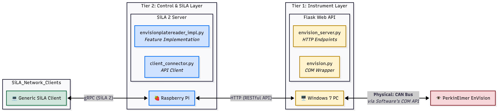

# PerkinElmer EnVision 2104 Plate Reader - SiLA 2 Server

This repository provides a SiLA 2 server and a Windows REST API bridge for the **PerkinElmer EnVision Plate Reader**.

This integration was developed to provide an independent, cross-platform interface for interoperability with the instrument. 

## Repository Structure

- `feature_definitions/`: The SiLA 2 Feature Definition (`.sila.xml`).
- `envision_windows_service/`: A lightweight Python Flask server designed to run on the instrument's host Windows PC. It interfaces with the manufacturer's COM objects to provide a network-accessible REST API.
- `envision_sila/`: The SiLA 2 server implementation. This is designed to run on a lightweight node (e.g., a Raspberry Pi) and translates SiLA commands into HTTP requests to the `envision_windows_service`.
- `examples/`: Utility scripts for running the SiLA server locally.

## Setup & Architecture

Due to the instrument's reliance on a Windows-based COM API, this solution uses a two-part architecture:
1. **API Server (Windows Host PC):** Exposes instrument functionalities as simple HTTP endpoints.
2. **SiLA 2 Server (e.g., Raspberry Pi):** Acts as a bridge between the SiLA network and the Windows API Server.



### 1. Windows Host PC Setup
1. Install Python 3.8 (the last version to officially support Windows 7).
2. Navigate to `envision_windows_service/` and install requirements:
   ```bash
   pip install -r requirements.txt
   ```
3. Run the API server (must be run on the same PC as the EnVision software):
   ```bash
   python envision_server.py
   ```

### 2. SiLA Server Setup
1. On your SiLA node (e.g., Raspberry Pi), install the package in editable mode:
   ```bash
   python -m pip install -e .
   ```
2. Start the SiLA server:
   ```bash
   python -m envision_sila --insecure